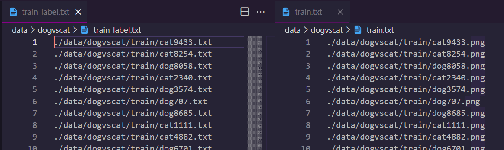

会话调度
========================================

Lumos中session作为graph的上层控制类，公共训练参数以及训练数据的前期处理都由session管理。session受manager管理，manager调度session完成网络训练，测试等完整流程。session之下的graph是独立的算法实现，session之上是独立的流程控制，session作为中间件实现流程控制和底层算法之间的有机连接。Session作为Lumos内部管理类，对外是不可见的。

.. image:: ../../_static/session_1.png

由于manager只管理调度流程，graph只注重算法实现，则关于各种运行流程所需的公共参数，数据等等则由session来管理，如下则为session的主要组成部分。

- 数据管理
- 公共参数

session在代码上的表现只不过是一个结构体以及一些接口，如下列表为session结构体中定义的所有参数和配套函数接口

**参数**

.. csv-table::
    :header: "名", "返回", "说明"
    :widths: 15, 10, 30

    "graph", "Graph *", "session管理的图实例"
    "batch", "int", "随机梯度下降每个批次的大小"
    "subdivision", "int", "单次运行加载的图像数量，避免内存过小无法一次完成batch个数据的计算"
    "height", "int", "运行所需图像的高，行数"
    "width", "int", "运行所需图像的宽，列数"
    "channel", "int", "运行所需图像的通道数"
    "dataset_num", "int", "数据集数据个数"
    "dataset_pathes", "char **", "数据集中每个数据存放地址"
    "labelset_pathes", "char **", "数据集中每个数据标签存放地址"
    "index", "int", "每次加载图像数据的起始索引位置"
    "input", "float **", "运行时加载的输入图像数据"
    "truth", "float **", "运行时输入数据对应的标签值"
    "workspace", "float *", "公共运行空间，保存计算中间值"

**接口**

| 名字             | 类型 | 说明             |
| ---------------- | ---- | ---------------- |
| bind_dataset     | void | 绑定运行数据集   |
| bind_labelset    | void | 绑定运行标签     |
| create_workspace | void | 创建公共运行内存 |

数据管理
--------------------------------------------

管理运行数据和标签，分绑定和加载两部分，由如下接口实现

| 名字              | 说明                       |
| ----------------- | -------------------------- |
| bind_dataset      | 绑定运行数据               |
| bind_labelset     | 绑定运行数据标签           |
| load_dataandlabel | 加载运行所需数据和数据标签 |

**绑定**

Lumos需要您提供数据集的清单以及对应的数据标签清单，它们都应该是一个文本文件，存放着您运行模型所需的每一个文件对应的存放地址

如图所示标签文件和数据文件在各自的清单中是对应的，第n行对应的数据其标签在标签清单中也应该在第n行

session绑定数据集及其标签属性，就是将这些存放在清单中的地址数据存入内存中，Lumos运行时不再重复读取数据清单而是直接从内存中获取数据和标签地址，所以

**bind_data**：读取数据集清单文件，将文件内容逐行保存到**session.dataset_pathes**

**bind_label**：读取标签清单文件，将文件内容逐行保存到**session.labelset_pathes**

加载
-------------------------------------------------

加载batch个数据作为模型运行的输入数据，在模型训练过程中会被多次调用。session中会记录每次读取数据的索引位置以及每次读取的数据个数（subdivision），读取的数据将存放于session.input中

| 名字        | 类型     | 说明                     |
| ----------- | -------- | ------------------------ |
| index       | int      | 加载数据的索引位置       |
| batch       | int      | 随机梯度下降的批次数     |
| subdivision | int      | 单次加载运行的数据数     |
| input       | float ** | 单次运行所需数据存放位置 |
| truth       | float ** | 数据对应表标签值         |

**load_dataandlabel**：加载运行所需数据集和对应标签，存放到**session.input**，**session.truth**

Lumos默认标签文件内的所有内容已经是可以直接进行运算的标签值，默认以空格为界限以浮点数类型加载标签数据。Lumos当前只支持图像数据，加载的图像数据需要经过缩放来符合运行需求，通过模型文件定义运行所需图形大小，height，width，channel，session在加载图像数据时会自动对图像进行缩放。

Lumos默认如果您的数据集大小无法被batch整除，在最后一次读取batch个数据时会回到数据集头部读取n个数据组成完整的batch个数据。

**公共运行空间**

公共运行空间用于存储中间计算结果，避免污染整体数据流。公共运行空间在session中创建作为session的一个属性值进行管理

| 名字      | 类型    | 说明         |
| --------- | ------- | ------------ |
| workspace | float * | 公共运行空间 |

**create_workspace**：统计graph运行时所需公共空间大小并创建，存放于**session.workspace**