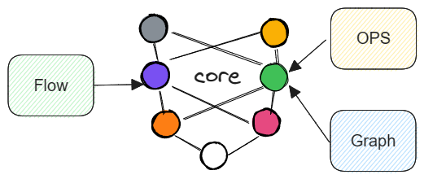

基本结构
=============================================

Lumos由如下三部分组成

- 算子实现——OPS
- 图构建——Graph
- 图调度——Flow

Lumos的基本逻辑可以划分为这三层，它们的结构关系如下图所示

.. image:: ../../_static/image-20230916134418409.png

多个算子构成一个计算图，计算图由调度模块进行调度。Lumos的灵活性集中体现在Graph中，Lumos支持您对Graph进行扩展和修改。

算子实现
-------------------------------------------

该模块在Lumos项目中处于最底层，采用面向对象的开发方式，代码位于Lumos/ops。所有底层算法都包含于该模块之中，算法以函数形式独立存在。

计算图
-------------------------------------------

这是Lumos框架的核心部分，包含Lumos的核心设计理念。

计算图由计算节点组成，即我们一般意义上的Layer，Layer具有一定的功能，与其他Layer的功能有明确的界限。计算图是由Layer组成的，所谓计算图只不过是一个空壳，只是一个有Layer组成的栈结构，如下图所示

.. image:: ../../_static/image-20230916141313443.png

Layer在栈中的前后关系决定了计算调度的先后顺序，Layer可以自定义，您可以构建所需的Layer，所谓Lumos的灵活性就在于此。

Layer
-------------------------------------------

layer与我们通常意义上深度学习算法中的layer是一样的，我们定义它是具有一定功能的独立计算节点，与其他layer在功能上具有明显差异。

Layer具有如下接口：

- make_name_layer
- init_name_layer_c
- init_name_layer_g
- refresh_name_layer_c
- refresh_name_layer_g
- forward_name_layer_c
- forward_name_layer_g
- backward_name_layer_c
- backward_name_layer_g
- update_name_layer_c
- update_name_layer_g

接口名中“name”表示您自定义的layer名，它是唯一的，不可以与其他layer重名，后缀_c与\_g分别代表是cpu运行函数还是gpu运行函数。如果您需要自定义layer，那么您需要实现上述接口，当然如果您只希望在cpu下运行，那么所有\_g的接口可以不用实现，反之亦然。

**接口描述**

.. csv-table::
    :header: "名", "参数", "返回"
    :widths: 30, 10, 15

    "make_name_layer", "可变", "Layer对象"

该接口用于创建layer对象，layer对象是我们构建的一个结构体，如果该结构体中缺少您所需的参数，您可以直接对该结构体进行扩展。您需要在该接口中初始化必要的参数，以及绑定该layer的其他默认接口。

.. code-block:: c
    :linenos:

    Layer *make_avgpool_layer(int ksize, int stride, int pad)
    {
        Layer *l = malloc(sizeof(Layer));
        
        l->type = AVGPOOL;
        l->pad = pad;

        l->ksize = ksize;
        l->stride = stride;

        l->initialize = init_avgpool_layer_c;
        l->forward = forward_avgpool_layer_c;
        l->backward = backward_avgpool_layer_c;
        l->update = update_avgpool_layer_c;
        l->initialize_gpu = init_avgpool_layer_g;
        l->forward_gpu = forward_avgpool_layer_g;
        l->backward_gpu = backward_avgpool_layer_g;
        l->update_gpu = update_avgpool_layer_g;

        return l;
    }

以上伪代码展示了该接口的基本功能。

**layer对象**

c语言在面向对象上具有先天缺陷，我们不主张使用一些特殊的方式去实现一种具有缺陷的面向对象过程，如果您需要使用额外的参数，请您直接在layer结构体定义中进行直接扩展。如果您需要查阅具体的layer结构体内部参数设置，请参阅接口文档。

.. csv-table::
    :header: "名", "参数", "返回"
    :widths: 30, 10, 15

    "init_name_layer", "可变", "void"
    "refresh_name_layer", "None", "void"

该接口用于初始化该layer节点，运行时内存应该在该接口中创建，必要的静态参数计算应该在该接口中进行。该接口必须拥有四个输入参数，一个layer结构体实体对象，以及输入数据的size，即weight，height，channel。

.. code-block:: c
    :linenos:

    void init_avgpool_layer(Layer *l, int w, int h, int c)

当然您可以在默认参数后添加您所需的其他参数。在计算图开始进行计算时，流控制模块会调度所有layer的初始化接口，来初始化计算图。

refresh接口实现对计算图的重置，释放所有运行时内存，所有静态参数重置。

.. csv-table::
    :header: "名", "参数", "返回"
    :widths: 30, 30, 10

    "forward_name_layer", "Layer l，int num", "void"
    "backward_name_layer", "Layer l，float rate，int num", "void"

forward表示前向计算过程，backward表示反向计算过程，即梯度计算过程，这两个接口是该layer的核心计算部分。

.. csv-table::
    :header: "名", "参数", "返回"
    :widths: 30, 30, 10

    "update_name_layer", "Layer l，float rate，int num", "void"

针对带有训练参数的layer，update实现该layer的权重更新。

Graph
--------------------------------------------

计算图由layer组成，graph不具有其他附加接口实现，就是一个结构体，而所有的图调度都由上层调度模块完成。

.. code-block:: c
    :linenos:

    typedef struct graph{
        int num;
        Layer **layers;
    } graph, Graph;

所有layer以线性的方式存储于**layers，flow调度模块也会以线性的方式从前向后进行调度处理。

Graph的意义不在于代码构建，而在于梯度计算，复杂数学计算可以分解为计算图，由链式求导法则可知，逆推导计算图，通过结算节点分解，大大减少了计算难度。而由于计算图的计算方式类似数据流，从开始经由不同计算节点一直流到最终结果，所以上层调度模块我们称之为flow，这与tensorflow的基本思路是一致的。