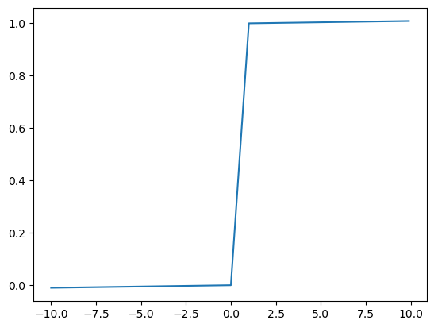

Activation
========

激活函数加在神经网络每一层输出之后，作用于输出数据，将输出数据映射到非线性激活区。

激活函数的意义在于，在神经网络中加入非线性因素，突破线性函数表达能力的局限

常见激活函数
------------

STAIR
~~~~~

stair激活函数计算如下：

.. math::

   stair(x)= \begin{cases} [x/2] && (mod([x],2)=0) \\
   (x+[x])+[x/2] && (mod([x],2) \neq 0)\end{cases} \\
   [x]表示不大于x的整数，mod(x,2)表示x对2取余

|image1|

梯度计算：

.. math::

   stair_{g}(x) = \begin{cases} 0 && [x]=x \\
   1  && [x] \neq x\end{cases}

HARDTAN
~~~~~~~

hardtan激活函数计算如下：

.. math::

   hardtan(x)=\begin{cases} -1 && (x< -1)\\
   1 && (x>1) \\
   x  && (x \in[-1,1]) \end{cases}

|image2|

梯度计算：

.. math::

   hardtan_{g}(x)=\begin{cases} 1 && x \in [-1,1] \\
   0 && x \notin [-1,1] \end{cases}

LINEAR
~~~~~~

linear激活函数计算如下：

.. math::

   linear(x)=x

|image3|

梯度计算：

.. math::

   linear_{g}(x)=1

LOGISTIC
~~~~~~~~

logistic激活函数计算如下：

.. math::

   logistic(x)=\frac{1}{1+e^{-x}}

|image4|

梯度计算：

.. math::

   logistic_{g}(x)=(1-x)*x

LOGGY
~~~~~

loggy激活函数计算如下：

.. math::

   loggy(x)=\frac{2}{1+e^{-x}}-1

|image5|

梯度计算：

.. math::

   y = \frac{x+1}{2}\\
   loggy_{g}(x)=2*(1-y)*y

RELU
~~~~

relu激活函数计算如下：

.. math::

   relu(x)= \begin{cases} x && x>0 \\
   0 && x \leq 0\end{cases}

|image6|

梯度计算：

.. math::

   relu_{g}(x)=\begin{cases} 1 && x>0 \\
   0 && x \leq 0\end{cases}

ELU
~~~

elu激活函数计算如下：

.. math::

   elu(x)= \begin{cases} x && x\ge 0 \\
   e^{x}-1 && x<0\end{cases}

|image7|

梯度计算：

.. math::

   elu_{g}(x)=\begin{cases} 1 && x \ge 0 \\
   x+1 && x<0\end{cases}

SELU
~~~~

selu激活函数计算如下：

.. math::

   selu(x)=\begin{cases} 1.0507*x && x \ge 0 \\
   1.0507*1.6732*(e^{x}-1) && x<0\end{cases}

|image8|

梯度计算：

.. math::

   selu_{g}(x)=\begin{cases} 1.0507 && x \ge0 \\
   x + 1.0507*1.6732 && x<0\end{cases}

RELIE
~~~~~

relie激活函数计算如下：

.. math::

   relie(x)=\begin{cases} x && x>0 \\
   0.01*x && x \leq 0\end{cases}

|image9|

梯度计算：

.. math::

   relie_{g}(x)=\begin{cases} 1 && x>0 \\
   0.01 && x \leq 0 \end{cases}

RAMP
~~~~

ramp激活函数计算如下：

.. math::

   ramp(x)= \begin{cases} x+0.1*x && x>0 \\
   0.1*x && x \leq 0 \end{cases}

|image10|

梯度计算：

.. math::

   ramp_{g}(x)=\begin{cases} 1.1 && x>0 \\
   0.1 && x \leq 0 \end{cases}

LEAKY RELU
~~~~~~~~~~

leaky relu激活函数计算如下：

.. math::

   leaky(x)=\begin{cases} x && x>0 \\
   0.1*x && x \leq 0\end{cases}

|image11|

梯度计算：

.. math::

   leaky_{g}(x)=\begin{cases} 1 && x>0 \\
   0.1 && x \leq 0 \end{cases}

TANH
~~~~

tanh激活函数计算如下：

.. math::

   tanh(x)=\frac{e^{2x}-1}{e^{2x}+1}

|image12|

梯度计算：

.. math::

   tanh_{g}(x)=1-x*x

PLSE
~~~~

plse激活函数计算如下：

.. math::

   plse(x)=\begin{cases} 0.01*(x+4) && x<-4 \\ 
   0.01*(x-4)+1 && x>4 \\
   0.125*x+0.5 && x \in [-4,4]\end{cases}

|image13|

梯度计算：

.. math::

   plse_{g}(x)=\begin{cases} 0.01 && x\in (-\infty,-4) \cup (4,+\infty) \\
   0.125 && x \in [-4,4] \end{cases}

LHTAN
~~~~~

lhtan激活函数计算如下：

.. math::

   lhtan(x)=\begin{cases} 0.001*x && x<0 \\
   0.001*(x-1)+1 && x>1 \\
   x && x \in [0,1] \end{cases}

|image14|

梯度计算：

.. math::

   lhtan_{g}(x)=\begin{cases} 0.001 && x\in (-\infty,0) \cup (1,+\infty) \\
   1 && x \in [0,1] \end{cases}

