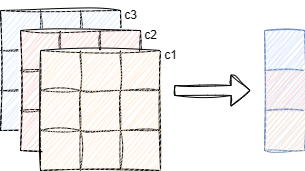
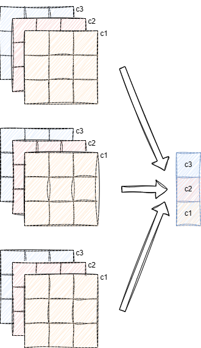
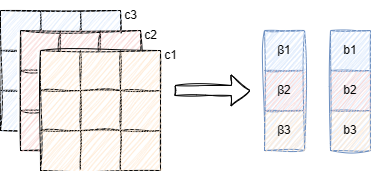

BatchNormalization
=================================

神经网络在参数更新后会导致数据分布的变化，网络收敛过程波动较大。通过归一化后，将每一层的输出数据归一化到均值为0方差为1的高斯分布中，可使收敛过程平缓，收敛效果更好。

批次归一化的方法与z-score数据标准化的方法是一致的

z-score 标准化
--------------

.. math::

   设数据集X（x1, x2, ...xn）有n个数据，数据集均值为M，数据集的标准差为σ\\
   M=\frac{\sum_{i=1}^{n}{x_i}}{n}\\
   \sigma = \sqrt{\frac{\sum_{i=1}^{n}{(x_i-M)^2}}{n}}

z-score标准化

.. math::

   x_{i}^{'}=\frac{x_i-M}{\sigma}

批次归一化即对每一层（直连层，卷积层）输出数据做z-score标准化

归一化
------

卷积层计算结果是一个三维数据集，h，w，c（直连层可视为
n,1,1的三维数据），批次归一化以通道channel为单位进行计算

如图所示，对每一个通道计算均值和方差，分别使用各通道计算的均值和方差对该通道数据进行标准化计算

多batch
-------

batch是网络训练的批次数量，即每次训练使用batch张图片，批次归一化针对的是batch个图像在该层输出数据的每一个通道进行计算

如图所示，对所有batch个数据每一个通道计算均值和方差，分别使用各通道计算的均值和方差对该通道数据进行标准化计算

**指数移动平均（Exponential Moving Average, EMA）**
---------------------------------------------------

batch
normalization是为了卷积后的数据分布一致，所使用的均值是整体数据集的均值，方差也是整体数据集的方差，但是训练过程中计算的是一个batch的均值和方差，由于训练是以batch为单位更新参数的，所以使用一个batch的均值和方差是合理的，但在测试过程中所使用的就应当是整体数据的均值和方差。

虽然在训练过程中可以记录下所有的均值和方差，最后再求一个整体的平均，但是这样做占用太多的存储空间，时间效率也非常低下，所以采用指数移动平均

.. math::

   EMA_i=\begin{Bmatrix} x_1 & i=1 \\ \beta x_{i}+(1-\beta)EMA_{i-1} & i \gt 1 \\ \end{Bmatrix} & \beta \in (0,1)\\

β越小当前抽样值权重越高，移动平均值实时性越强；β越大局部异常数据影响越小，移动平均值越平稳

在batch normalization中选择β为0.99

训练过程结束后rolling_mean和rolling_variance会作为训练参数存入权重文件，供测试时使用

Batch Normalize前向推导
-----------------------

z-score计算式如下

.. math::

   x_{i}^{'}=\frac{x_i-M}{\sigma}

batch
normalize还需要缩放因子γ和偏置项β，是为了防止数据分布呈现标准分布（mean=0，variance=1），γ和β是训练参数，跟随网络训练过程而改变，为输出数据带来更好的分布

.. math::

   x_{i}^{'}=\gamma\frac{x_i-M}{\sigma}+\beta

|image1|

每一个通道对应一个缩放因子β和一个偏执项b

标准差σ可能为0，为了保证上式计算时，分母永不为0，添加一个极小数0.000001，所以最终的计算式为

.. math::

   x_{i}^{'}=\gamma(\frac{x_i-M}{\sqrt{\sigma^{2} + 0.000001}})+\beta

梯度计算
--------

.. math::

   \begin{aligned}
   设y&=\gamma \hat y + \beta=\gamma(\frac{x_i-M}{\sqrt{\sigma^{2} + 0.000001}})+\beta \\
   \hat y &= \frac{x_i-M}{\sqrt{\sigma^{2} + 0.000001}} \\
   \frac{\partial y}{\partial x_{i}} &= \gamma \frac{\partial \hat y}{\partial x_{i}}
   \end{aligned}

我们可以将计算式y做如下分解

.. math::

   \hat y = f(x_{i},M,\sigma^{2})=\frac{x_i-M}{\sqrt{\sigma^{2} + 0.000001}}

则由求导的链式法则可知

.. math::

   \begin{aligned}
   \frac{\partial \hat y}{\partial x_{i}}&=\frac{\partial f(x_{i},M,\sigma^{2})}{\partial x_{i}} \frac{\partial x_{i}}{\partial x_{i}}+\frac{\partial f(x_{i},M,\sigma^{2})}{\partial M} \frac{\partial M}{\partial x_{i}} + \frac{\partial f(x_{i},M,\sigma^{2})}{\partial \sigma^{2}} \frac{\partial \sigma^{2}}{\partial x_{i}} \\
   &=\frac{\partial \hat y}{\partial x_{i}}+ \frac{\partial \hat y}{\partial M} \frac{\partial M}{\partial x_{i}}+\frac{\partial \hat y}{\partial \sigma^{2}} \frac{\partial \sigma^{2}}{\partial x_{i}}
   \end{aligned}

分别求导可得

.. math::

   \begin{aligned}
   \frac{\partial \hat y}{\partial x_{i}}&=\frac{1}{\sqrt{\sigma^{2}+0.000001}} \\
   \frac{\partial \hat y}{\partial M} &= \frac{-1}{\sqrt{\sigma^{2}+0.000001}} \\
   \frac{\partial \hat y}{\partial \sigma^{2}} &= -\frac{1}{2}(x_{i}-M)(\sigma^{2}+0.000001)^{-\frac{3}{2}} \\
   \frac{\partial M}{\partial x_{i}}&=\frac{1}{n} \\
   \frac{\partial \sigma^{2}}{\partial x_{i}}&= \frac{2}{n}(x_{i}-M)
   \end{aligned}

这里值得注意的是方差的求导过程，如下

.. math::

   \frac{\partial \sigma^{2}}{\partial x_{i}}=\frac{2}{n}(x_{i}-M)-\frac{2}{n^2}\sum^{n}_{i=1}(x_{i}-M) \\
   事实上\frac{2}{n^2}\sum^{n}_{i=1}(x_{i}-M)=0 \\
   因为\sum x_{i} = \sum M

权重更新
--------

分别对缩放因子和偏执求导

.. math::

   \begin{aligned}
   y_{i}&=\gamma(\frac{x_i-M}{\sqrt{\sigma^{2} + 0.000001}})+\beta \\
   \frac{\partial y_{i}}{\partial \gamma} &= \frac{x_{i}-M}{\sqrt{\sigma^{2}+0.000001}} \\
   \frac{\partial y_{i}}{\partial \beta} &= 1
   \end{aligned}

则在矩阵运算条件下，权重更新公式如下

.. math::

   \begin{aligned}
   \gamma_{update} &= \gamma + rate * \sum_{i=1}^{n}(\frac{x_{i}-M}{\sqrt{\sigma^2+0.000001}}*delta_{i}) \\
   \beta_{update} &=\beta + rate * \sum_{i=1}^{n}delta_{i} 
   \end{aligned}

