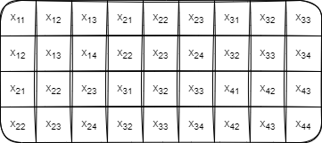
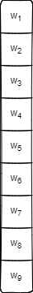
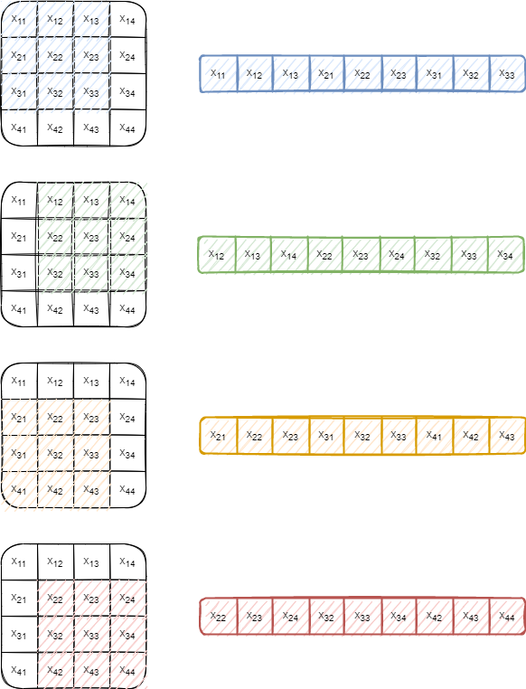
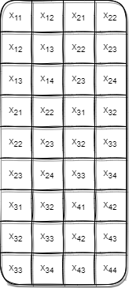
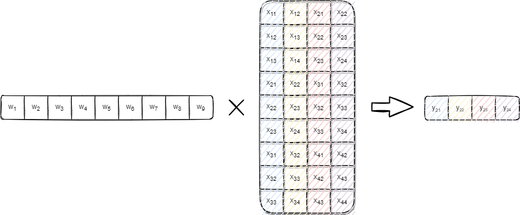
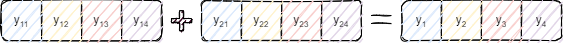
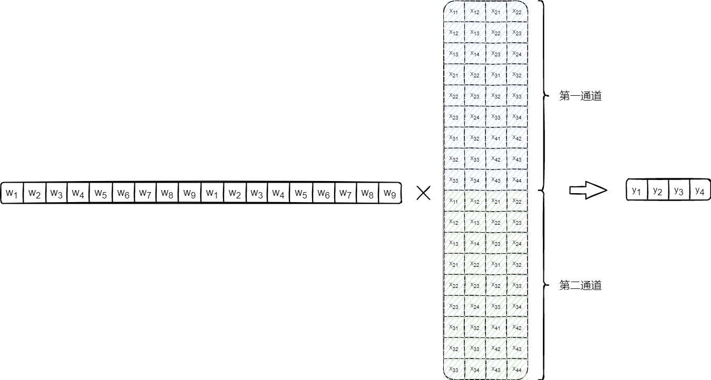
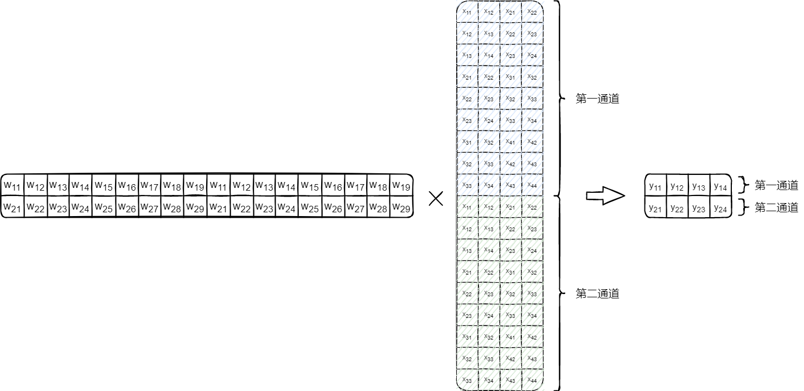
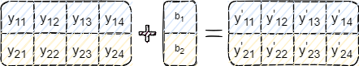
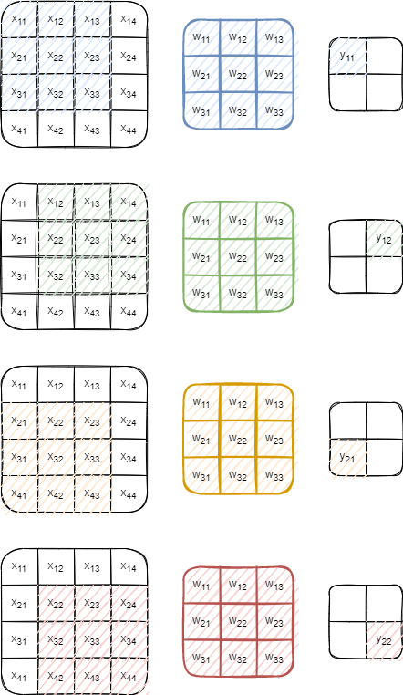

Convolutional
===============

卷积神经网络最基本操作就是卷积，如下图，卷积核以滑动窗口的模式，分别与对应元素相乘并求和

|image1|

.. math::

   \begin{aligned}
   y_{11}=x_{11}w_{11}+x_{12}w_{12}+x_{13}w_{13}+x_{21}w_{21}+x_{22}&w_{22}+x_{23}w_{23}+x_{31}w_{31}+x_{32}w_{32}+x_{33}w_{33} \\
   y_{12}=x_{12}w_{11}+x_{13}w_{12}+x_{14}w_{13}+x_{22}w_{21}+x_{23}&w_{22}+x_{24}w_{23}+x_{32}w_{31}+x_{33}w_{32}+x_{34}w_{33} \\
   &\vdots
   \end{aligned}

卷积计算
--------

卷积神经网络最主要的计算消耗就是卷积计算

im2col
~~~~~~

图像的卷积计算有很多种算法，目前各个开源框架常用的都是im2col+gemm的方式

该方法的做法，就是将卷积过程转化为矩阵乘法，其好处在于可以通过优化矩阵乘算法，优化计算过程，并且有利于CUDA等并行计算

设有图像A，它的一个通道数据如下：

卷积核W，展开为列向量如下：

我们将每次卷积计算时，卷积核覆盖的元素分别列出如下：

将这些展开的元素行向量组合为矩阵如下：

则卷积过程可表示为如下矩阵乘：

则每一次卷积运算可表示如下：

.. math::

   \begin{aligned}
   &z_{l}=w_{l}a_{l-1} \\
   &a_{l}=\sigma(z_{l})=\sigma(w_{l}a_{l-1})
   \end{aligned}

**图像的多通道**
~~~~~~~~~~~~~~~~

卷积层的图像都是三维张量n*m*z，对于多通道的图像使用一个卷积核卷积，每一个通道都会生成一份结果，我们需要将它们累加起来

设有一个通道为2的图像，我们的卷积过程如下

通道1：

通道2：

最终卷积结果应该为：

在代码实现中以Caffe和darknet为例，上述数据在经过im2col处理后应当如下

一下是darknet中im2col的代码

.. code:: c

   void im2col_cpu(float* data_im,
        int channels,  int height,  int width,
        int ksize,  int stride, int pad, float* data_col)
   {
       int c,h,w;
       int height_col = (height + 2*pad - ksize) / stride + 1;
       int width_col = (width + 2*pad - ksize) / stride + 1;
       int channels_col = channels * ksize * ksize;
       for (c = 0; c < channels_col; ++c) {
           int w_offset = c % ksize;
           int h_offset = (c / ksize) % ksize;
           int c_im = c / ksize / ksize;
           for (h = 0; h < height_col; ++h) {
               for (w = 0; w < width_col; ++w) {
                   int im_row = h_offset + h * stride;
                   int im_col = w_offset + w * stride;
                   int col_index = (c * height_col + h) * width_col + w;
                   data_col[col_index] = im2col_get_pixel(data_im, height, width, channels,
                           im_row, im_col, c_im, pad);
               }
           }
       }
   }

多卷积核
~~~~~~~~

一般一个卷积层有多个卷积核filters

设有两个卷积核W1、W2

那么卷积过程如下：

Bias偏移量
~~~~~~~~~~

和全连接神经网络一样，需要加上偏移量

.. math::

   w_{k}a_{k-1}+b_{k}

在卷积神经网络中，有些许不同，不是每一个输出值都对应一个偏移值，而是一个channel对应一个相同的偏移值

以上述示例为例，两个卷积核，结果为两个通道

所以卷积层bias数量和卷积核数量filters一样

激活函数
~~~~~~~~

计算结果的每一个值都需要通过激活函数计算

权重更新
--------

综上所述，将卷积过程表示为了矩阵乘，那么可以直接套用全连接神经网络的推导过程，完全相同的实现流程

