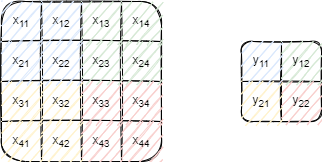
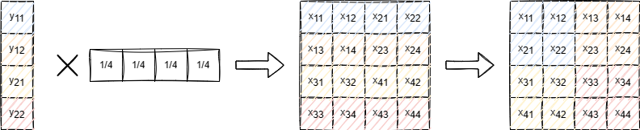
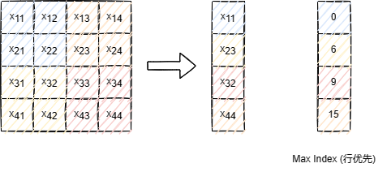
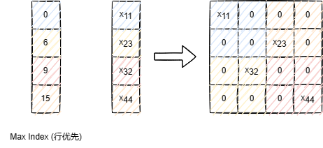
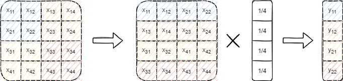

Pooling
============

池化一般用于降采样过程，在很多前沿的网络结构中已经不再使用该处理过程，转而直接使用纯卷积网络

池化的基本流程如下，将图像分为多个ksize*ksize大小的区域，每个区域映射到一个输出

由映射方式不同，分为均值池化和最大值池化

均值池化
--------

每个输出是区域中ksize*ksize个数值的均值

.. math::

   \begin{aligned}
   y_{11}=\frac{x_{11}+x_{12}+x_{21}+x_{22}}{4} \\
   y_{12}=\frac{x_{13}+x_{14}+x_{23}+x_{24}}{4} \\
   y_{21}=\frac{x_{31}+x_{32}+x_{41}+x_{42}}{4} \\
   y_{22}=\frac{x_{33}+x_{34}+x_{43}+x_{44}}{4}
   \end{aligned}

最大值池化
----------

每个输出是区域中ksize*ksize个数值的最大值

.. math::

   \begin{aligned}
   y_{11}=max(x_{11},x_{12},x_{21},x_{22}) \\
   y_{12}=max(x_{13},x_{14},x_{23},x_{24}) \\
   y_{21}=max(x_{31},x_{32},x_{41},x_{42}) \\
   y_{22}=max(x_{33},x_{34},x_{43},x_{44})
   \end{aligned}

反向传播
--------

.. _均值池化-1:

均值池化
~~~~~~~~

均值池化的计算可以表示如下

|image1|

.. math::

   a_{k}=wa_{k-1}

.. math::

   \begin{aligned}
   \frac{\partial a_{k+1}}{\partial a_{k}}&=\frac{\partial wa_{k}}{\partial a_{k}}=w^{T}
   \end{aligned}

则均值池化的反向传播计算可表示如下

.. _最大值池化-1:

最大值池化
~~~~~~~~~~

在区域数值中选择最大值作为输出，其本身是一种线性的对应关系，所以反向传播也只需满足对应即可

如下图所示，最大值池化前向计算如下

则反向传播如下

